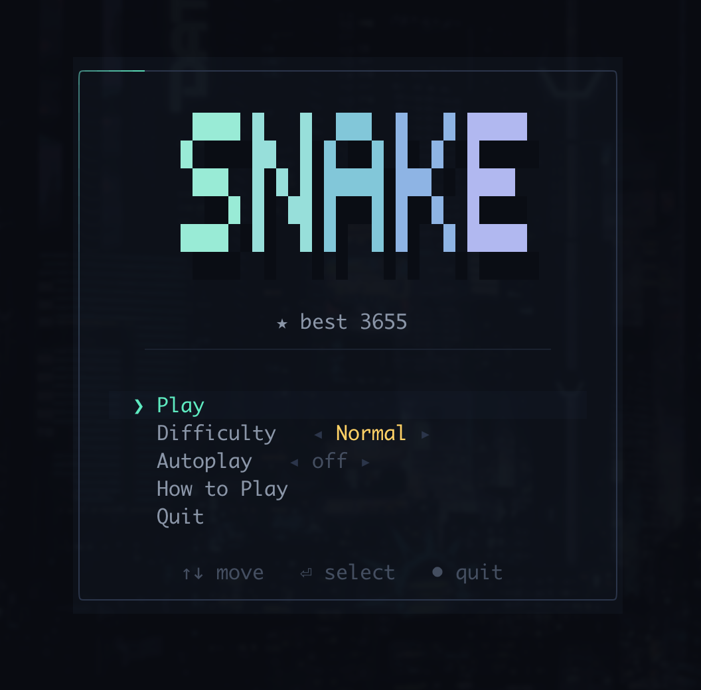
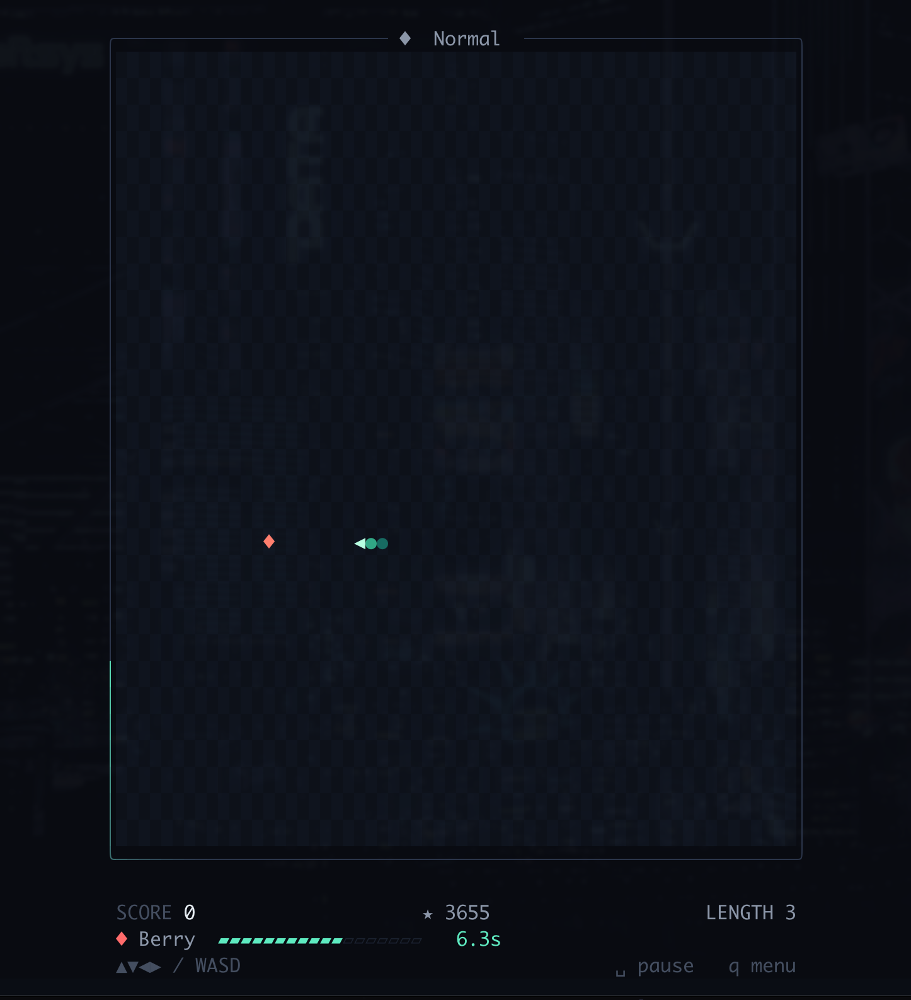
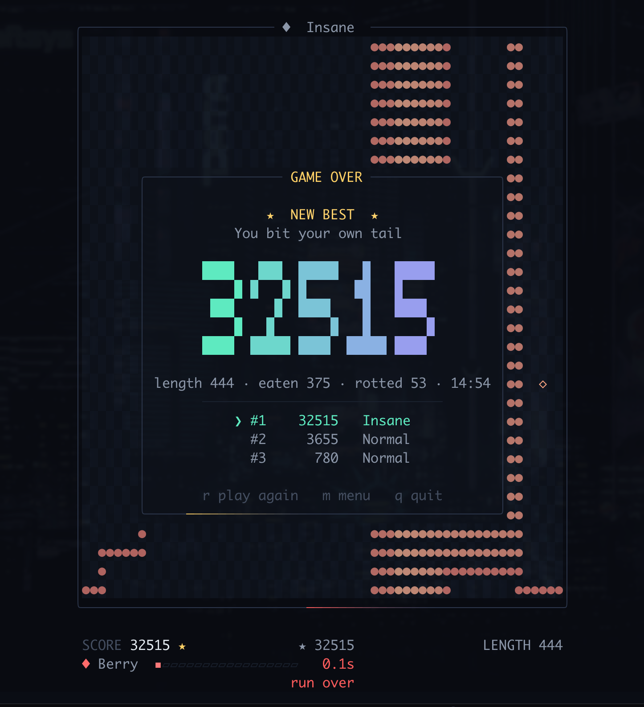

# Snake

**Note:** This repository is entirely generated by Deepseek v4 Flash. I did this experiment as an introduction to agentic coding.

---

A terminal Snake in Rust, rendered entirely with Unicode box-drawing and
geometric glyphs. Some changes to the arcade original: **the edges wrap**, so the
board is a torus and running out of room is impossible, and **food rots**. Every
piece has a shelf life, shown as a meter under the board, and a piece you ignore
is a piece you lose. Biting your own tail is the only way to die. There is an autoplay mode.

<p>



</p>

## Running it

```
cargo run --release
```

## Controls

| Key | Action |
| --- | --- |
| Arrows / `WASD` / `hjkl` | Steer |
| `space`, `esc` | Pause and resume |
| `q` | Back to the menu (or quit, from the menu) |
| `r` | Play again, from the pause screen |
| `ctrl-c` | Quit from anywhere |

## Wrapping edges

Leave one side of the board and the snake re-enters on the opposite one. A step
that crosses an edge is wrapped with `rem_euclid`, so it works in all four
directions without the negative coordinates a plain `%` would produce. The
self-collision check runs against the wrapped position, so you can still turn
back into your own tail on the far side.

## The food timer

Each piece of food carries a countdown. It is shown in three places at once, so
you never have to look away from the snake:

- **A meter under the board** — the primary readout, with the seconds remaining
  printed beside it.
- **The frame around the board** — the travelling light on the border glows
  mint, then amber, then red as the food ages. You can read the urgency from
  the colour of the frame without focusing on it.
- **The food itself** — it pulses, starts blinking, and grows a warning halo of
  dots in the four neighbouring cells once it is close to rotting.

When a piece rots, it vanishes, your combo resets, and a fresh one is placed.
Missing food is never fatal on its own — but it costs you the combo, which is
where most of the points are.

| Food | Points | Lifetime (Normal) |
| --- | --- | --- |
| `◆` berry | 10 | 10s |
| `★` golden | 25 | 5s |

Chaining meals within five seconds of each other builds a multiplier up to ×9,
which is why a rotten piece hurts: it is not the 10 points you lost, it is the
multiplier you dropped.

## Difficulty

`Chill`, `Normal` and `Insane` change the snake's starting and top speed, and
how long food survives. High scores are kept per difficulty in
`~/Library/Application Support/terminal-snake/scores.txt` on macOS (or
`$XDG_DATA_HOME/terminal-snake/scores.txt` elsewhere). A score table that is
missing, empty or corrupt is treated as empty rather than as an error.

The snake also gets faster as it eats, up to a per-difficulty ceiling.

## Autoplay

A menu toggle that hands steering to the snake itself: each step it scores every legal move by how much open space stays reachable (flood fill), skips any move that would leave it with less room than its own length, and uses BFS shortest-path to the fruit as the tie-break — so on an open board it beelines for the berry, and on a crowded one it prefers to keep circulating over chasing food it can't safely reach. It respects wrapping edges, only follows a tail cell when the tail actually vacates, and never reverses; player turns are ignored while it's on, though pause and menu still work. It's deliberately one move deep against the body as it stands, so past roughly half-board fill it will eventually trap itself.

## Implementation notes

The only dependency is [`crossterm`](https://crates.io/crates/crossterm).

**Rendering is hand-rolled and diffed.** Each frame is composed into an
off-screen grid of cells in `canvas.rs`, then compared against the previous
frame; only the cells that actually changed are written, with runs of identical
styling coalesced into a single write. On a mostly-static board that is a few
hundred bytes per frame, which is what makes the animation smooth rather than
strobing. `--dump` and `tools/render_check.py` render the same screens outside a
terminal, which is how the layout tests and the visual checks work.

**Colour is authored in 24-bit and downgraded at the edge.** The palette in
`theme.rs` is plain RGB; `ColorMode::detect()` reads `COLORTERM`/`TERM` and
`Rgb::to_color` downgrades to the nearest xterm-256 or 16-colour entry, so a
limited terminal gets a sensible approximation instead of garbage. The
"how to play" screen reports which mode was detected.

**The simulation is pure.** `game.rs` knows nothing about terminals: it is a
grid, a deque of segments, and a clock. It is driven by explicit `update(dt)`
calls, so the tests run entire games in microseconds without a terminal.

**Speed is normalised for the cell aspect ratio.** A terminal cell is roughly
twice as tall as it is wide, so moving one cell vertically covers twice the
distance it does horizontally. Vertical steps are therefore given twice the
duration, which keeps the snake's apparent speed identical in every direction
and makes crossing the board take as long top-to-bottom as it does
left-to-right. `CELL_ASPECT` in `game.rs` is the single place that assumption
lives; a test asserts the two crossing times match.

**Structure**

| File | Role |
| --- | --- |
| `main.rs` | Argument parsing, terminal setup, the frame loop |
| `app.rs` | Which screen is showing, and what each key does |
| `views.rs` | Drawing every screen |
| `game.rs` | Snake rules, food lifetime, particles |
| `canvas.rs` | Cell buffer, diffing renderer |
| `ui.rs`, `font.rs` | Frames, meters, headings, the 5×5 block font |
| `theme.rs` | Palette and glyph vocabulary |
| `scores.rs`, `rng.rs` | High-score persistence, a small PRNG |

The RNG is a 24-line xorshift seeded from the clock and an ASLR-dependent
address — the game needs "pick a free cell" and "scatter some sparks", which is
not worth a dependency.

## Development

```
cargo test                 # 40 tests: rules, layout geometry, rendering
cargo clippy --all-targets

# Render a screen as text, no terminal required
cargo run -- --dump menu --size 100x30
cargo run -- --dump game
cargo run -- --dump over
cargo run -- --dump help

# Look at the block font
cargo test font::tests::preview -- --ignored --nocapture

# Drive the real game in a pty and reconstruct what it paints
python3 tools/render_check.py
python3 tools/quit_probe.py ./target/debug/snake /tmp/probe.txt
```

`--dump` prints the heading's drop shadow as `░` so the letters underneath stay
readable in plain text.
